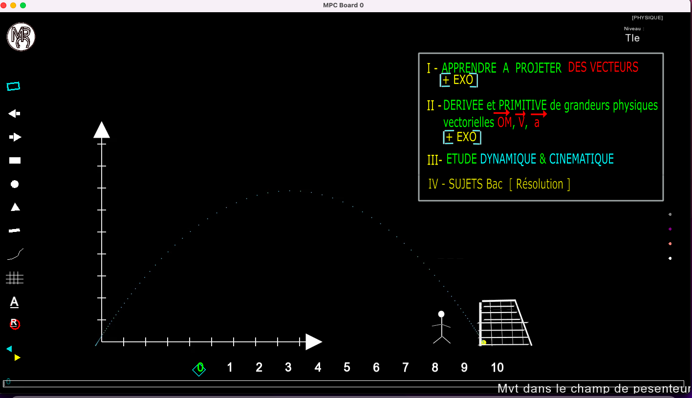
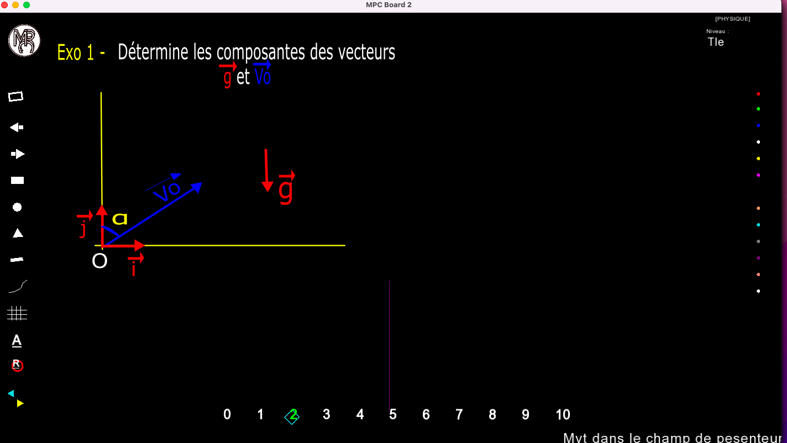
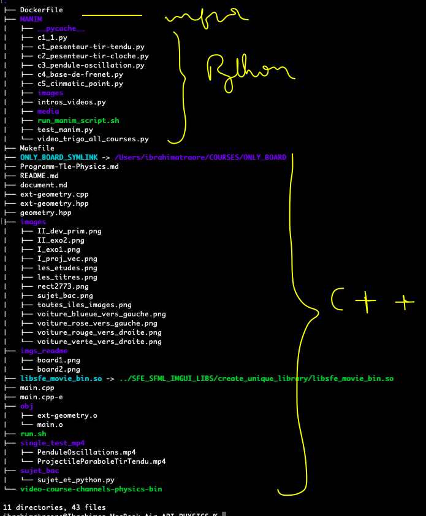
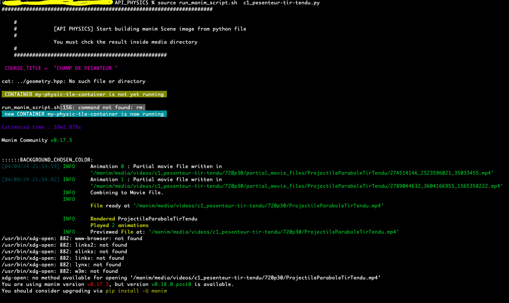
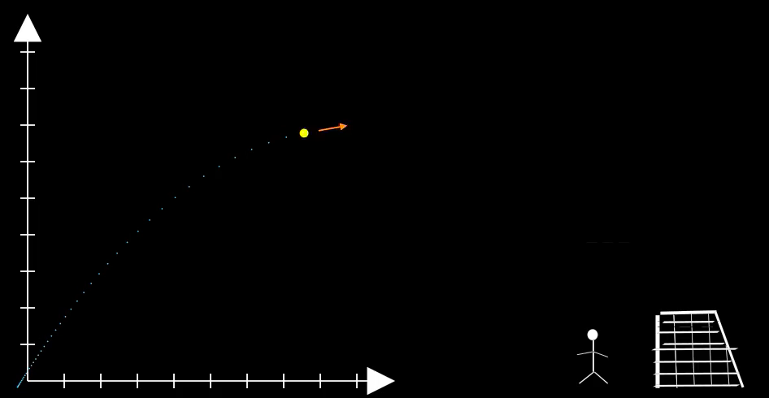

<h1 style="border:2px solid; text-align:center;color:blue">API_PHYSICS</h1>

<h4>
DESCRIPTION:
 This is boards application for maths video course</h4>

<h4 style="color:orange">Arborescence</h4>

 As you can see, i have symbolic link to link the created library ../SFE_SFML_IMGUI_LIBS/create_unique_library/libsfe_movie_bin.so We can notice that the rpositoy is compose of Python scipts[aka MANIM] directory, C++ scripts and Dockerfile

<h4 style="color:orange">PROCESS TO USE THIS API_PHYSICS</h4>
<ol>
<!-- ........................... -->
<li>
	<h3>Dockerfile</h3>
	Inside the Dockerfile, we load Manim docker image because to generate video mp4 with Manim python script, we will work inside dockr container. So make sure your docker engine has started.If you already have manim docker image, skip his step
	<pre>load your docker manim image[If it does not yet exists] docker build . -t manim_image  OR source run.sh build</pre>
	<pre>REPOSITORY     TAG       IMAGE ID       CREATED       SIZE
physic_image   latest    57d07b244732   3 hours ago   3.84GB
manim_image    latest    b4e1b47b59a2   2 days ago    2.24GB</pre>
</li>
<!-- ........................... -->
<li><h3>MANIM directory (python scripts to build mp4 video)</h3></h4>
	<ol>
		<li style="border 1px solid"><h4>Create your manim scene. You have some example of manim  python script:intros_videos.py - c1_1.py
c1_pesenteur-tir-tendu.py
c2_pesenteur-tir-cloche.py
c3_pendule-oscillation.py
c4_base-de-frenet.py
c5_cinmatic_point.py
intros_videos.py
test_manim.py
video_trigo_all_courses.py ...</h4> 
		</li>
		<li style="border 1px solid"><h4>  Shell Script tu run python script inde container and generate mp4 video:</h4>
			<pre>cd MANIM && source run_manim_script c1_pesenteur-tir-tendu.py
			 OR  
			source run.sh MANIM/c1_pesenteur-tir-tendu.py </pre>
			example:<pre>source MANIM/run_manim_script.sh MANIM/c1_pesenteur-tir-tendu.py  OR    source run.sh MANIM_DIR/mypython_script.py </pre>
			

			you can see the script has three scenes, so i choose to run the first(aka 1).
			 The script run inside container and after i get the mp4 file with sharing volumes with the host (here host "media" directory), so i open it: <pre>open media/videos/c1_pesenteur-tir-tendu/720p30/ProjectileParaboleTirTendu.mp4 </pre>
			

 
		</li>
		<li style="border 1px solid"><h4>Save your mp4 files to DiskE</h4>
			<pre>source run.sh save</pre>

			It will save the new generated scene, which lies inside shared directory called media 
			(shared directory between host and docker, because here MANIM runs his script inside docker) into DiskE

		</li>
		<li style="border 1px solid"><h4>LETS'S RESUME ALL POSSIBLES MENUS</h4>
			<ol>
				<li>To Stop and remove manim current container[maths or physic or chemistry]Container<pre>source run.sh down</pre></li>
				<li>To build current manim image [for maths or physic or chemistry If it is not yet done]<pre>source run.sh build</pre></li>
				<li>To set symbolik link wih library[If it is not yet done]: SFE_SFML_IMGUI_LIBS/create_unique_library/libsfe_movie_bin.so <pre>source run.sh symlib OR source run.sh symlink_lib</pre></li>
				<li>To run your python script to generate mp4 video scene:<pre>source run.sh myscript.py</pre></li>
				<li>To save generated mp4 files to DiskE.Alog will show you where it has been saved<pre>source run.sh save</pre></li>
				<li>To set the symbolik link with ONLY_BOARD(because the API needs some class and methods from ONL_YBOARD)<pre>source run.sh symlink_ob OR source run.sh symb_ob</pre>ob stands for Only Board</li>
				<li>To run makefile: make re <pre>source run.sh make</pre></li>
				<li>To run make clean,fclean,re<pre>source run.sh makec</pre></li>
				<li>To clean and fclean with Makefile: make fclean && make clean<pre>source make clean</pre></li>
			</ol>
		</li>
		<li style="border 1px solid"><h4>HOW TO INEGRATE MP4 generated video to the API ? </h4>
			<ol>
				<li>DiskE Reperory where we have saved mp4 files according to topic(maths, physic,chemistry and school class level 
					<ol>
						<li>
							

							[Command to list repositories  with absolute path]:
							

							<pre style="margin-left=0;">
							find "$(readlink -f .)" -maxdepth 1 -mindepth 1 -type d | grep VIDEOS
							</pre>
							<pre style="margin-left=0;">
							+> +> +> /Volumes/DiskE/INTROS_OUTROS_VIDEOS
							</pre>
							<pre>
							+> +> +> /Volumes/DiskE/MY_CHANELS_VIDEOS_ICONS
							</pre>
							<pre>
							+> +> +> /Volumes/DiskE/ONLINE_VIDEOS
							</pre>
							<pre>
							+> +> +> /Volumes/DiskE/QUICTIME-PLAYER-VIDEOS
							</pre>
							<pre>
							+> +> +> /Volumes/DiskE/VIDEOS-1ere-Chemistry-mp4 [script option "save" will save chemistry class 1ere here]
							</pre>
							<pre>
							+> +> +> /Volumes/DiskE/VIDEOS-1ere-Maths-mp4 [script option "save" will save Maths 1ere videos here]
							</pre>
							<pre>
							+> +> +> /Volumes/DiskE/VIDEOS-1ere-Physic-mp4 [script option "save" will save Physic 1ere videos here]
							</pre>
							<pre>
							+> +> +> /Volumes/DiskE/VIDEOS-Intro-mp4 [script option "save" will save videos intro here]
							</pre>
							<pre>
							+> +> +> /Volumes/DiskE/VIDEOS-Tle-Chemistry-mp4 [script option "save" Chemistry for level Tle here]
							</pre>
							<pre>
							+> +> +> /Volumes/DiskE/VIDEOS-Tle-Maths-mp4 [script option "save" Maths for Terminal level here]
							</pre>
							<pre>
							/+> +> +> Volumes/DiskE/VIDEOS-Tle-Physics-mp4 [script option "save" Physics for Tle here]
							</pre>
							<pre>
							+> +> +> /Volumes/DiskE/VIDEOS_MONTAGE
							</pre>
						</li>
					</ol>  
				</li>
				<li>[STEP 1] Go To ONLY_BOARD/board-ext-geometry.hpp, and set thos MACROS
					<pre>
						#define  MATHS_VIDEO_INDEX 0 //0:intro, 1: first viedo, 2: second video, ...5 
						#define  PHYSICS_VIDEO_INDEX 1 //0:intro, 1: first viedo, 2: second video, ...5 
						#define CHEMISTRY_VIDEO_INDEX 0 //0:intro, 1: first viedo, 2: second video, ...5 
						#define PROGRAMMING_VIDEO_INDEX 0 //0:intro, 1: first viedo, 2: second video, ...5 
						//#define CODING_VIDEO_INDEX 0 //0:intro, 1: first viedo, 2: second video, ...5 
						#define  MATHS_MUSIC_INDEX 0  //[0, 1] because i have only two music
					</pre>
				</li>
					<li>[STEP 2] mount DiskE andG o to ONLY_BOARD/board-ext-geometry.cpp and add your videos to list <pre>const char *EXT_MP4_[MATHS|PHYSIC|CHEMISTRY|PROGRAMMING]_FILES_ARRAY_FROM___BOARD_EXT_GEOMETRY_CPP[]={ }</pre> 
					<pre>You can also add your music in this array:  const char *EXT_MP3_FILES_ARRAY[] =  { }</pre>
					 
				</li>
				<li>[STEP 3]: Go to API_MATHS/main.cpp to instanciate your media files(video and/or  music) Your media files class can have three instance, so if 
					<ol>
						<li>
							You are working on maths domain(this is the default). So inside the API_MATHS/main.cpp instanciate your class
							<pre> ext::AnimatedSFE_MOVIES anim_movies;</pre>
							<pre>
							ext::AnimatedSFE_MOVIES mymusic = ext::AnimatedSFE_MOVIES(MATHS_MUSIC_INDEX);
							</pre>Feel free to instance more han one class if you have many mp4 videos to display inside differents boards 
							so you will need to declare like:
							[Please Read API_MATHS for more details about this party]
						</li>
					</ol>
				</li>
			</ol>
		</li>
		<li>
			<h4>How To add Images to this API ?: see exaple i did in api-physics[API_PHYSICS/blob/master/ext-geometry.hpp]</h4>
			
You need to set a class in your ext-geometry.hpp (with or namespace) like: mvt_chp_pesanteur::MouvementChampPesenteur

			 and developp the class method in xt-geometry.cpp like:
			<pre>
				mvt_chp_pesanteur::MouvementChampPesenteur::MouvementChampPesenteur(){
				std::string volume_abs_path("/Users/ibrahimatraore/COURSES/API_PHYSICS/images/");
				//std::string path = volume_abs_path + std::string("projection_vecteur.svg");
				this->counter = -1; 
				/// WINDOW: 0
				this->containerTexture_vector[++this->counter] = sf::Texture();
				if( this->containerTexture_vector[this->counter].loadFromFile(volume_abs_path + std::string("les_titres.png")) ){ 
					this->sprit_img_containers[this->counter] = sf::Sprite(this->containerTexture_vector[ this->counter ]);
					this->sprit_img_containers[this->counter].setPosition(sf::Vector2f(WIDTH/2 + 136, 70.f)); // absolute position
				}else {
					std::cout << "Impossible de charger video animation\n"; exit(1);
				} 
				/// WINDOW: 1
				this->containerTexture_vector[++this->counter] = sf::Texture();
				if( this->containerTexture_vector[this->counter].loadFromFile(volume_abs_path + std::string("I_proj_vec.png")) ){ 
					this->sprit_img_containers[this->counter] = sf::Sprite(this->containerTexture_vector[ this->counter ]);
					this->sprit_img_containers[this->counter].setPosition(sf::Vector2f(100, 50.f)); // absolute position
				}else {
					std::cout << "Impossible de charger video animation\n"; exit(1);
				} 
				//Add sprites infos to screenAndHisSpritesPositions (from screen class)
				// It will help us to manage dynamic eraser color
				sc.addSpriteInfosToSuitableScreen(1, this->sprit_img_containers[this->counter]);
				//---------------------------------------------------------------------//
				//EXO1: /// WINDOW: 2
				this->containerTexture_vector[++this->counter] = sf::Texture();
				if( this->containerTexture_vector[this->counter].loadFromFile(volume_abs_path + std::string("I_exo1.png")) ){ 
					this->sprit_img_containers[this->counter] = sf::Sprite(this->containerTexture_vector[ this->counter ]);
					this->sprit_img_containers[this->counter].setPosition(sf::Vector2f(100, 50.f)); // absolute position
				}else {
					std::cout << "Impossible de charger I_exo1.png\n"; exit(1);
				}
				//Add sprites infos to screenAndHisSpritesPositions (from screen class)
				// It will help us to manage dynamic eraser color
				sc.addSpriteInfosToSuitableScreen(2, this->sprit_img_containers[this->counter]);
				//---------------------------------------------------------------------//
				//DERIVEE PRIMITIVE: /// WINDOW: 3
				this->containerTexture_vector[++this->counter] = sf::Texture();
				if( this->containerTexture_vector[this->counter].loadFromFile(volume_abs_path + std::string("II_dev_prim.png")) ){ 
					this->sprit_img_containers[this->counter] = sf::Sprite(this->containerTexture_vector[this->counter]);
					this->sprit_img_containers[this->counter].setPosition(sf::Vector2f(100, 50.f)); // absolute position
				}else {
					std::cout << "Impossible de charger II_dev_prim.png\n"; exit(1);
				} 
				//Add sprites infos to screenAndHisSpritesPositions (from screen class)
				// It will help us to manage dynamic eraser color
				sc.addSpriteInfosToSuitableScreen(3, this->sprit_img_containers[this->counter]);
				//---------------------------------------------------------------------//
				//EXO - DERIVEE PRIMITIVE: /// WINDOW: 4
				this->containerTexture_vector[++this->counter] = sf::Texture();
				if( this->containerTexture_vector[this->counter].loadFromFile(volume_abs_path + std::string("II_exo2.png")) ){ 
					this->sprit_img_containers[this->counter] = sf::Sprite(this->containerTexture_vector[this->counter]);
					this->sprit_img_containers[this->counter].setPosition(sf::Vector2f(100, 50.f)); // absolute position
				}else {
					std::cout << "Impossible de charger II_dev_prim.png\n"; exit(1);
				} 
				//Add sprites infos to screenAndHisSpritesPositions (from screen class)
				// It will help us to manage dynamic eraser color
				sc.addSpriteInfosToSuitableScreen(4, this->sprit_img_containers[this->counter]);
				//---------------------------------------------------------------------//
				//EXO - DERIVEE PRIMITIVE /// WINDOW: 5
				/*this->containerTexture_vector[++this->counter] = sf::Texture();
				if( this->containerTexture_vector[this->counter].loadFromFile(volume_abs_path + std::string("II_exo2.png")) ){ 
					this->sprit_img_containers[this->counter] = sf::Sprite(this->containerTexture_vector[this->counter]);
					this->sprit_img_containers[this->counter].setPosition(sf::Vector2f(WIDTH/2 + 90, 80.f)); // absolute position
				}else {
					std::cout << "Impossible de charger II_dev_prim.png"; exit(1);
				} */
				//EXO - DERIVEE PRIMITIVE /// WINDOW: 6
					++this->counter; //[because the previous course will tabke two windows]
				this->containerTexture_vector[++this->counter] = sf::Texture();
				if( this->containerTexture_vector[this->counter].loadFromFile(volume_abs_path + std::string("les_etudes.png")) ){ 
					this->sprit_img_containers[this->counter] = sf::Sprite(this->containerTexture_vector[this->counter]);
					this->sprit_img_containers[this->counter].setPosition(sf::Vector2f(100, 50.f)); // absolute position
				}else {
					std::cout << "Impossible de charger II_dev_prim.png\n"; exit(1);
				} 
				//Add sprites infos to screenAndHisSpritesPositions (from screen class)
				// It will help us to manage dynamic eraser color
				sc.addSpriteInfosToSuitableScreen(6, this->sprit_img_containers[this->counter]);
				//---------------------------------------------------------------------//
				//LES ETUDES /// WINDOW: 7
				this->containerTexture_vector[++this->counter] = sf::Texture();
				if( this->containerTexture_vector[this->counter].loadFromFile(volume_abs_path + std::string("les_etudes.png")) ){ 
					this->sprit_img_containers[this->counter] = sf::Sprite(this->containerTexture_vector[this->counter]);
					this->sprit_img_containers[this->counter].setPosition(sf::Vector2f(100, 50.f)); // absolute position
				}else {
					std::cout << "Impossible de charger II_dev_prim.png\n"; exit(1);
				} 
				//Add sprites infos to screenAndHisSpritesPositions (from screen class)
				// It will help us to manage dynamic eraser color
				sc.addSpriteInfosToSuitableScreen(7, this->sprit_img_containers[this->counter]);
				//---------------------------------------------------------------------//
				//SUJETS BAC /// WINDOW: 8
				this->containerTexture_vector[++this->counter] = sf::Texture();
				if( this->containerTexture_vector[this->counter].loadFromFile(volume_abs_path + std::string("sujet_bac.png")) ){ 
					this->sprit_img_containers[this->counter] = sf::Sprite(this->containerTexture_vector[this->counter]);
					this->sprit_img_containers[this->counter].setPosition(sf::Vector2f(100, 50.f)); // absolute position
				}else {
					std::cout << "Impossible de charger II_dev_prim.png"; exit(1);
				} 
			}
			mvt_chp_pesanteur::MouvementChampPesenteur::~MouvementChampPesenteur(){
			}
			</pre>
			
And inside main.cpp, you can instanciate your class like:  <pre>mvt_chp_pesanteur::MouvementChampPesenteur mchp;</pre>And call it like: 

			
		</li>
		<li><h4>M E N U S</h4>
		<pre>
		Shortcuts: SFE-MOVIES-MENU
		.... Space - Play / pause 
		.... S - Stop 
		.... R - Reset 
		.... H - Hide / show user controls and mouse cursor
		.... F - Toggle fullscreen 
		.... I - Log media info and current state 
		.... Alt + V - Select next video stream 
		.... Alt + A - Select next audio stream 
		.... Alt + S - Select next subtitle stream 
		.... Alt + P - Music Volume + 
		.... Alt + M - Music Volume - 
		.... [No Shortcut for timeline]:simply click inside and move mouse cursor
		</pre>
		</li>
		<li style="border 1px solid">USEFULL INFO: Paremetrage
			<pre>Please, set these Macro used by the following class in board-ext-geometry.hpp
				#define EXTERN_BACKGROUND_CHOSEN_COLOR BLACK
				#define EXTERN_MENU_SHAPE_COLOR BLACK 
				#define EXTERN_SCREEN_STROKE_COLOR WHITE</pre>
			<pre>I remove Imgui from this API so , do not set IMGUI MACROS</pre>
		</li>
	</ol>
</li>
</ol>

######  DES LIENS UTILS:
###### [Physic-Maths] https://talkingphysics.wordpress.com/2019/01/08/getting-started-animating-with-manim-and-python-3-7/

###### site Maths Myriam: https://www.annales2maths.com/e3c2-2019-2020/

###### https://docs.manim.community/en/stable/tutorials/quickstart.html#transforming-a-square-into-a-circle

###### https://azarzadavila-manim.readthedocs.io/en/latest/geometry.html#rectangle

###### class definition: https://docs.manim.community/en/stable/reference/manim.mobject.graphing.coordinate_systems.CoordinateSystem.html

###### Youtube: https://www.youtube.com/watch?v=MOv6yN7b2aI&list=PLWOlLjdyZm2NQD1YZmEPB0dwbd0yKINAT&index=1

###### convert to gif 
https://www.zamzar.com/uploadComplete.php?session=5111fb3e3738c3a399ab6b6d77266e98&tcs=Z85

###### AnimatedGIFS: code source origin:
    https://github.com/SFML/SFML/wiki/Source:-Animated-GIF

###### Imgui-SFML: 
	https://github.com/SFML/imgui-sfml

###### SF-SVG 
	https://github.com/kamirr/sf-svg

